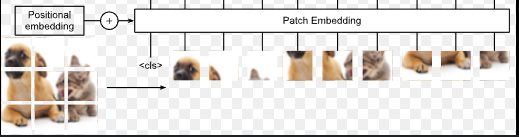
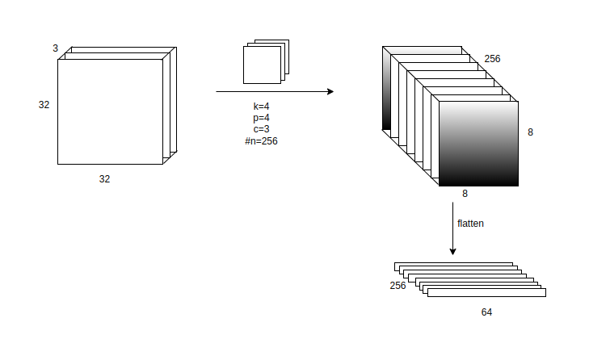

# ViT

As we all know Transformer architecture, taken up the world by Storm.  

In this Repo, I practised (from scratch) how we implement this to Vision. Transformers are data hungry don't just compare with CNN (not apples to apple comparison here)


#### Model
<div align='center'></div>


**Patches**
```python
nn.Conv2d(
            in_chans, 
            emb_dim, 
            kernel_size = patch_size, 
            stride = patch_size
        )
```
<div align='center'>
    
    
</div>


> [!NOTE] CASUAL MASK
> Unlike in words, we don't use casual mask here.


<div align='center'></div>

At Final Projection layer,
- pooling (combine) and projected what peredicted layer
- Add One Token before train transformer-block after then pick that token pass it to projection layer (like `BERT` did)  << ViT chooses

```python

        # Transformer Encoder
        xformer_out = self.enc(out) # [batch, 65, 384]
        if self.is_cls_token:
            token_out = xformer_out[:,0] # [batch, 384]
        else:
            token_out = xformer_out.mean(1)

        # MLP Head
        projection_out = self.mlp_head(token_out) # [batch, 10]

```


#### Context Grad-CAM 
[Xplain AI](https://github.com/jacobgil/pytorch-grad-cam)

- register_forward_hook::  hook will be executed during the forward pass of the model